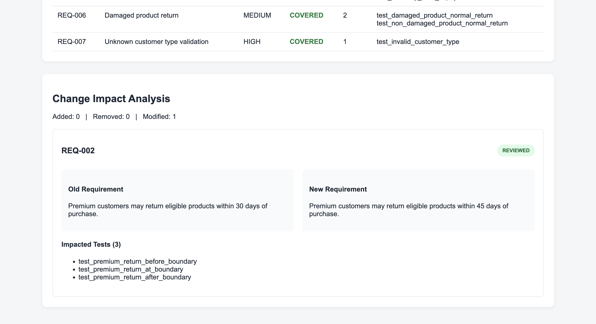
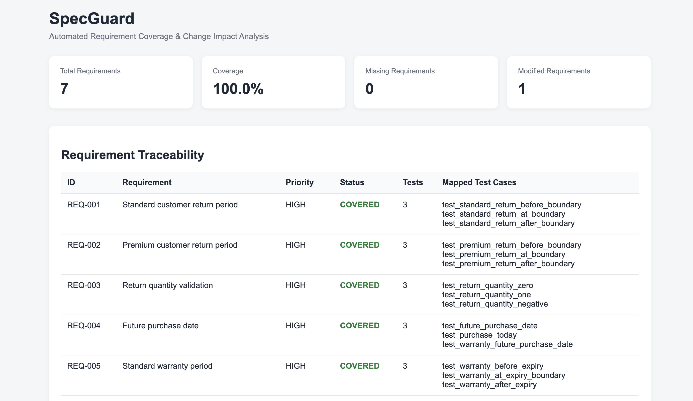

# SpecGuard

**Automated Requirement Coverage & Change Impact Analysis for QA**

SpecGuard is a Python-based QA engineering tool that connects software requirements with automated test cases. It helps identify untested requirements and shows which tests may need review when a requirement changes.

The project demonstrates requirement traceability, boundary value analysis, negative testing, regression testing, static code analysis, change-impact analysis, and automated testing with Pytest.

## Problem

Requirements frequently change during software development. When this happens, QA engineers need to determine:

- Is every requirement covered by a test?
- Which tests are associated with a particular requirement?
- Which requirements changed between versions?
- Which existing tests may be affected by those changes?
- Have the impacted tests been reviewed?

SpecGuard automates this traceability and change-impact analysis.

## How It Works

The project contains a fictional e-commerce returns and warranty system called **NovaCart**.

Requirements are stored in YAML files and assigned IDs such as:

```text
REQ-001
REQ-002
REQ-003
```

Pytest tests are linked to requirements using custom markers:

```python
@pytest.mark.requirement("REQ-002")
def test_premium_return_at_boundary():
    ...
```

SpecGuard scans the test source code using Python's Abstract Syntax Tree (AST) and creates mappings such as:

```text
REQ-002
├── test_premium_return_before_boundary
├── test_premium_return_at_boundary
└── test_premium_return_after_boundary
```

It then calculates requirement coverage and compares requirement versions to identify changes and impacted tests.

## Requirement Change Example

A key scenario in the project demonstrates what happens when a business requirement changes.

### Version 1

Premium customers could return eligible products within **30 days**.

Boundary tests were designed for:

```text
29 days → accepted
30 days → accepted
31 days → rejected
```

### Version 2

The requirement changed from **30 days to 45 days**.

SpecGuard detects that `REQ-002` was modified and identifies the three tests associated with the requirement.

After the application was updated to the new 45-day rule while the old tests were intentionally left unchanged, the 31-day test failed because it still expected the previous behavior.

The tests were then updated to the new boundary:

```text
44 days → accepted
45 days → accepted
46 days → rejected
```

After regression testing, all tests passed.

This demonstrates how requirement changes can make existing automated tests stale even when the application behavior is correct.

## Features

- YAML-based requirement definitions
- Requirement-to-test traceability
- Automated requirement coverage calculation
- Detection of missing requirement coverage
- Requirement version comparison
- Added, removed, and modified requirement detection
- Change-impact analysis
- Identification of tests affected by requirement changes
- Manual review-status tracking
- HTML QA dashboard generation
- Static Python test analysis using AST
- Automated unit testing with Pytest
- Continuous Integration with GitHub Actions

## Testing Techniques Demonstrated

### Boundary Value Analysis

Examples include:

```text
Standard return boundary: 13, 14, 15 days
Premium return boundary: 44, 45, 46 days
Warranty boundary: 364, 365, 366 days
Quantity boundary: -1, 0, 1
```

### Negative Testing

The project tests scenarios such as:

- Invalid return quantities
- Future purchase dates
- Unsupported customer types
- Damaged products using the normal return process

### Equivalence Partitioning

Unsupported customer type values are represented using an invalid value such as `gold`.

### Requirement Traceability

Every business requirement is linked to one or more automated test cases using requirement IDs.

### Regression Testing

Affected tests are rerun after requirement and application changes to verify the updated behavior.

## Project Structure

```text
specguard-project/
├── .github/
│   └── workflows/
│       └── tests.yml
├── app/
│   ├── __init__.py
│   └── rules.py
├── config/
│   └── review_status.yaml
├── reports/
│   └── specguard_report.html
├── requirements/
│   ├── requirements_v1.yaml
│   └── requirements_v2.yaml
├── specguard/
│   ├── __init__.py
│   ├── change_detector.py
│   ├── html_report.py
│   ├── requirement_parser.py
│   ├── review_tracker.py
│   └── test_mapper.py
├── specguard_tests/
├── tests/
├── pytest.ini
├── requirements.txt
├── run_specguard.py
└── README.md
```

## Automated Tests

The project currently contains **30 automated tests**.

```text
NovaCart business-rule tests       18
SpecGuard change-detector tests     4
Requirement-parser tests            2
AST test-mapper tests               3
Review-tracker tests                2
HTML-report tests                   1
                                  ───
Total                              30
```

Run all tests with:

```bash
pytest tests specguard_tests -v
```

Expected result:

```text
30 passed
```

## Running SpecGuard

Install the dependencies:

```bash
pip install -r requirements.txt
```

Run the analysis:

```bash
python run_specguard.py
```

The generated QA dashboard is available at:

```text
reports/specguard_report.html
```

On macOS it can be opened with:

```bash
open reports/specguard_report.html
```

## Dashboard

### Requirement Coverage & Traceability



### Requirement Change Impact Analysis



The HTML dashboard displays:

- Total requirements
- Requirement coverage percentage
- Missing requirements
- Modified requirements
- Requirement-to-test traceability
- Old and new requirement descriptions
- Impacted test cases
- Review status

For the current example:

```text
Total Requirements:    7
Requirement Coverage:  100%
Missing Requirements:  0
Modified Requirements: 1
```

## Continuous Integration

GitHub Actions runs the complete automated test suite on every push and pull request to the `main` branch.

The CI workflow:

1. Checks out the repository.
2. Sets up Python.
3. Installs project dependencies.
4. Executes the NovaCart and SpecGuard test suites.

This verifies the project in a clean environment rather than relying only on the local development machine.

## Technology Stack

- Python
- Pytest
- PyYAML
- Python AST
- HTML/CSS
- Git
- GitHub Actions

## Key Learning Outcomes

This project demonstrates how QA automation can extend beyond executing functional tests. SpecGuard combines automated testing with requirement traceability and change-impact analysis to help identify gaps and maintain tests as software requirements evolve.

It also demonstrates an important distinction: **100% requirement coverage means every requirement has at least one mapped test; it does not guarantee that the tests cover every possible scenario or are effective at detecting every defect.**